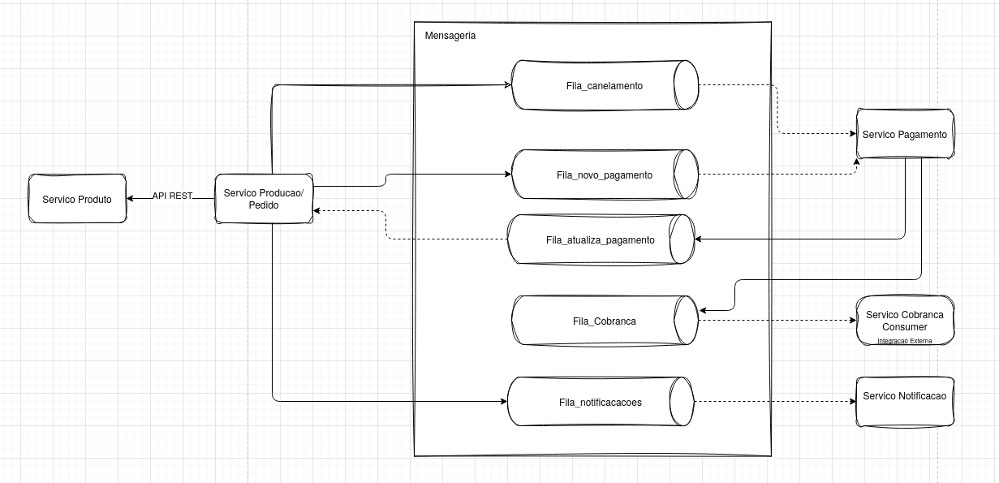
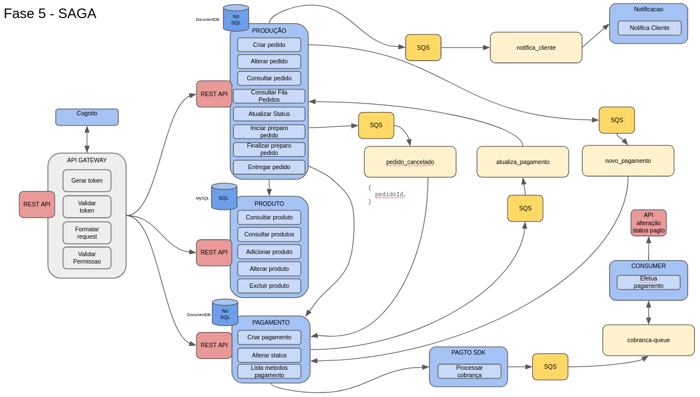
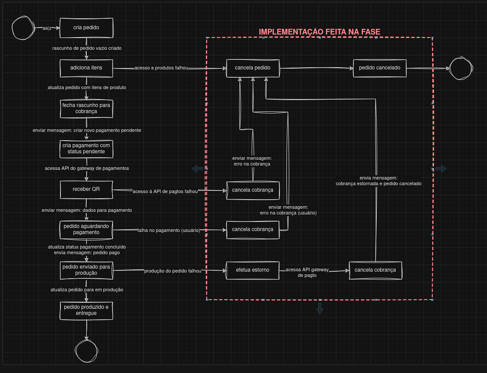
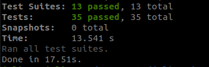
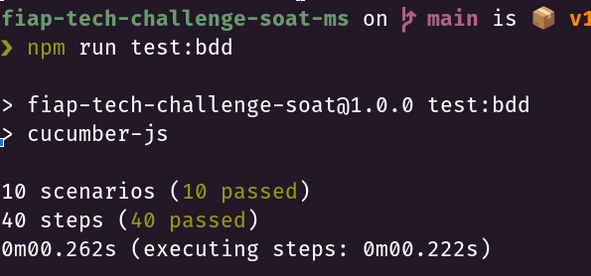
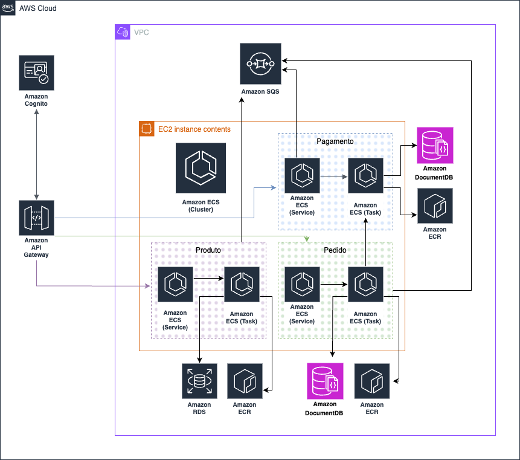

# Tech Challenge - Pós-Tech SOAT - FIAP - Produto

Este é o projeto desenvolvido durante a fase 5 do curso de pós-graduação em arquitetura de software da FIAP - turma II/2023.

Membros do grupo 30:
Diórgenes Eugênio da Silveira - RM 349116
Elton de Andrade Rodrigues - RM 349353
Gabriel Mendes - RM 348989
Juliana Amoasei dos Reis - RM 348666


## Repositórios

- [Infraestrutura](https://github.com/diorgeneseugenio/fiap-tech-challenge-soat-terraform)
- [Producao](https://github.com/EltonARodrigues/fiap-tech-challenge-soat-producao)
- [Produto](https://github.com/gabrielmendessilva/fiap-tech-challenge-soat-ms-produto)
- [Pagamento](https://github.com/JulianaAmoasei/fiap-tech-challenge-ms-pagamento)
- [Autorizacao](https://github.com/JulianaAmoasei/fiap-auth-service-cognito)

### Changelog Fase V:

- **SAGA Coreografada**: Ajustado o projeto para seguir o padrao SAGA do tipo coreografado em todos os Microservicos;
- **LGPD Remocao**: Adicionado API para requisitar a exclusao dos dados pessoais;
- **LGPD Relatorio de impacto**: Adicionado API para relatorio de impacto dos dados pessoais;
- **Refatoração do sistema de infraestrutura** Atualizacoes no deploy AWS e execucao no eks para testes locais;

## SAGA Coreografia

Durante a fase 4 do projeto a separacao do monolito em microservicos seguiu o principio de desacoplamento, permitindo a melhor divisao das tarefas entre os integrantes. Ao avaliar a utilizacao de um orquestrador como SAGA observamos que essa decisão implicaria em um extenso trabalho de refatoração nos microsserviços existentes, mesmo que eles já estejam desacoplados.

### Vantagens Coreografia
Algumas vantagens da Coreografia lenvando em contexto a evolucao e desenvolvimento do nosso projeto durante as fases:

- **Implementação rápida:** A coreografia é mais rápida de implementar, especialmente com um número reduzido de microsserviços e da forma que a separacao seguiu na fase 4.
- **Simplicidade:** Não há necessidade de criar um novo serviço de orquestração, simplificando a arquitetura.
- **Menos etapas:** O fluxo de comunicação é mais direto, envolvendo apenas o microsserviço de pedido/pagamento e a etapa de pagamento.

### Revisão e Criação de Filas:

Para implementar a coreografia, as filas foram revisadas e criadas utilizando o AWS SQS como sistema de mensageria. O processamento das transações internas dos microsserviços também foi revisado e corrigido para evitar que falhas de processamento afetem o fluxo do pedido.

### Resultado:

A coreografia parece ser a opção mais adequada para a fase 5 devido à sua simplicidade, rapidez de implementação e menor quantidade de etapas a serem gerenciadas. 

Estrutura da SAGA Coreografada no projeto:


Distribuicao dos microservicos:


Fluxo da realizacao de um pedido:



### Relatórios OWASP ZAP
Disponibilizado em formato html:
-  [Relatório Inicial](docs/owasp/producao_antes.html)
-  [Relatório Corrigido](docs/owasp/producao_depois.html)

## Stack utilizada

- Node.js v20
- TypeScript
- DynamoDB
- Express
- Mongoose
- Docker
- AWS
  - DocumentDB
  - RDS
  - ECS
  - ECR
  - SQS
  - API GATEWAY
  - LOAD BALANCE


### Teste Unitario

Teste unitario com JEST:

Comando: `npm run test`



#### Teste BDD

Para os testes de BDD o projeto está utilizando o cucumber presente no diretorio `features`

Comando: `npm run test:bdd`


## DEPLOY
### Deploy AWS

O projeto é baseado na infraestrutura da AWS, o que requer o provisionamento de recursos e a configuração do deploy. As etapas incluem:

Utilização do repositório de [infraestrutura](https://github.com/diorgeneseugenio/fiap-tech-challenge-soat-terraform) para realizar o deploy do Terraform na AWS.

Após o provisionamento, é necessário configurar os secrets no github Action de cada repositório de microserviço. Isso permite que a cada merge na branch main seja realizado o build, push da imagem no RDS e deploy no ECS. Os procedimentos devem ser executados nos seguintes repositórios:
- [Producao](https://github.com/EltonARodrigues/fiap-tech-challenge-soat-producao)
- [Produto](https://github.com/gabrielmendessilva/fiap-tech-challenge-soat-ms-produto)
- [Pagamento](https://github.com/JulianaAmoasei/fiap-tech-challenge-ms-pagamento/tree/main)
- [Autorizacao](https://github.com/JulianaAmoasei/fiap-auth-service-cognito)

Por fim, dentro do API Gateway criado pelo Terraform, é necessário adicionar a autorização lambda nos endpoints dos microserviços.

### EKS Local
Para o deploy local utilize o repositorio de infra seguindo os passos do EKS + localstack no README.

### Desenvolvimento Localhost

Execute o microservico com o npm e o docker-compose.yml com o localstack + banco de dados para utilizar no desenvolvimento

### Endpoints

Esta API fornece documentação no padrão OpenAPI.
Os endpoints disponíveis, suas descrições e dados necessários para requisição podem ser consultados e testados em ```/api-docs```.

`GET /produto?categoriaId={categoriaId}`
pega lista de todos os produtos recebendo o ID da categoria via query string.
`GET /produto/:id`
pega um produto específico pelo ID
`POST /produto`
cria um novo produto
`PUT /produto/:id`
atualiza os dados de um produto pelo ID
`DELETE /produto/:id`
exclui um produto da base de dados pelo ID
`POST /produto/:idProduto/imagens`
adiciona uma string de endereço de imagem de produto
`DELETE /produto/:idProduto/imagem/:idImagem`
exclui uma string de endereço de imagem de produtos

`GET /categoria`
pega a lista de todas as categorias cadastradas
`GET /categoria/:id`
pega uma categoria específica pelo ID
`POST /categoria`
cria uma nova categoria
`PUT /categoria/:id`
atualiza os dados de uma categoria pelo ID
`DELETE /categoria/:id`
exclui uma categoria existente pelo ID

### 1. Cadastrar Produtos

1.1 O projeto já cria as principais categorias(Lanche, Acompanhamento, Bebida, Sobremesa);

1.2 - Cadastro do produto:
```json
{
  "nome": "produto 1",
  "preco": 0.1,
  "descricao": "demo 1",
  "categoriaId": "1c941831-c8cb-43a3-8d3f-2959a6fb7241",
  "imagens": [
    {
      "url": "demo.png"
    }
  ]
}
```

## Desenvolvimento do projeto

### Diagramas

- Separação dos serviços




### Estrutura do Projeto

O projeto foi reestruturado seguindo o padrão do clean architecture. 

- `datasources`:  comunicação dos serviços externos como banco de dados e checkout;
- `domain`:  contém a camada de domínio da aplicação com suas entidades, casos de uso e repositórios;
- `interfaceAdapters`: camada de interface do clean architecture com o controlador;
- `presenters`: camada externa de comunicacao externa onde se entra a API;

```shell
.
├── src
│   ├── datasources
│   │   └── database
│   │       ├── config
│   │       │   └── interfaces
│   │       ├── models
│   │       ├── repository
│   │       └── seeders
│   ├── domain
│   │   ├── entities
│   │   │   ├── types
│   │   │   └── valueObjects
│   │   ├── repositories
│   │   └── useCases
│   ├── interfaceAdapters
│   │   └── controllers
│   └── presenters
│       └── api
│           ├── config
│           │   └── interfaces
│           └── routers
│               └── schemas
```

### Domain

Contém a camada de domínio da aplicação e as lógicas de negócio.

```shell
│   ├── domain
│   │   ├── entities
│   │   │   ├── types
│   │   │   │   ├── CategoriaType.ts
│   │   │   │   └── produtoType.ts
│   │   │   ├── valueObjects
│   │   │   │   ├── cpf.ts
│   │   │   │   └── email.ts
│   │   │   ├── categoria.ts
│   │   │   ├── ImagemProduto.ts
│   │   │   └── produto.ts
│   │   ├── repositories
│   │   │   ├── categoriaRepository.ts
│   │   │   └── produtoRepository.ts
│   │   └── useCases
│   │       ├── categoriaUseCase.ts
│   │       └── produtoUseCase.ts

```

O diretório `domain` contém as entidades definidoras do negócio, como `produto`, `categoria` e seus casos de uso. A interface entre a camada de domínio e o restante da aplicação foi definida através do uso de interfaces em `repositories`.

### datasources

Contém a camada responsável pela comunicação com as diversas bases de dados utilizadas pelo serviço.

```shell
│   ├── datasources
│   │   └── database
│   │       ├── config
│   │       │   ├── interfaces
│   │       │   │   └── db.config.interface.ts
│   │       │   └── db.config.ts
│   │       ├── models
│   │       │   ├── categoriaModel.ts
│   │       │   ├── index.ts
│   │       │   ├── produtoImagensModel.ts
│   │       │   └── produtoModel.ts
│   │       ├── repository
│   │       │   ├── categoriaDatabaseRepository.ts
│   │       │   └── produtoDatabaseRepository.ts
│   │       └── seeders
│   │           └── cria-categorias.ts

```


### interface adapters e presenters

A camada de adapters e presenters interagem com o core da aplicação.

```shell
│   ├── interfaceAdapters
│   │   └── controllers
│   │       ├── categoriaController.ts
│   │       └── produtoController.ts
│   ├── presenters
│   │   └── api
│   │       ├── config
│   │       │   ├── interfaces
│   │       │   │   └── server.config.interface.ts
│   │       │   └── server.config.ts
│   │       ├── routers
│   │       │   ├── schemas
│   │       │   │   ├── categoriaRouter.schema.ts
│   │       │   │   └── produtoRouter.schema.ts
│   │       │   ├── categoriaRouter.ts
│   │       │   ├── index.ts
│   │       │   ├── produtoRouter.ts
│   │       │   └── utils.ts
│   │       ├── index.ts
│   │       └── swaggerConfig.ts
```
